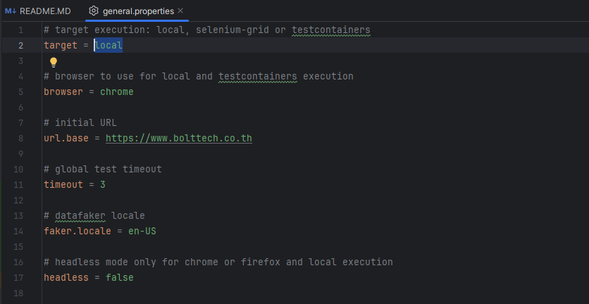
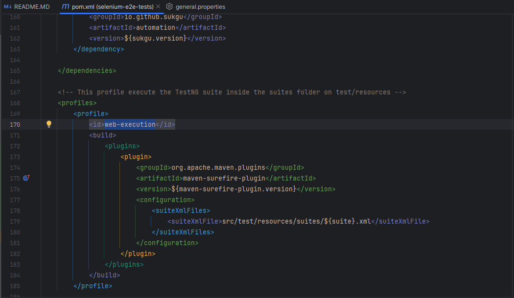
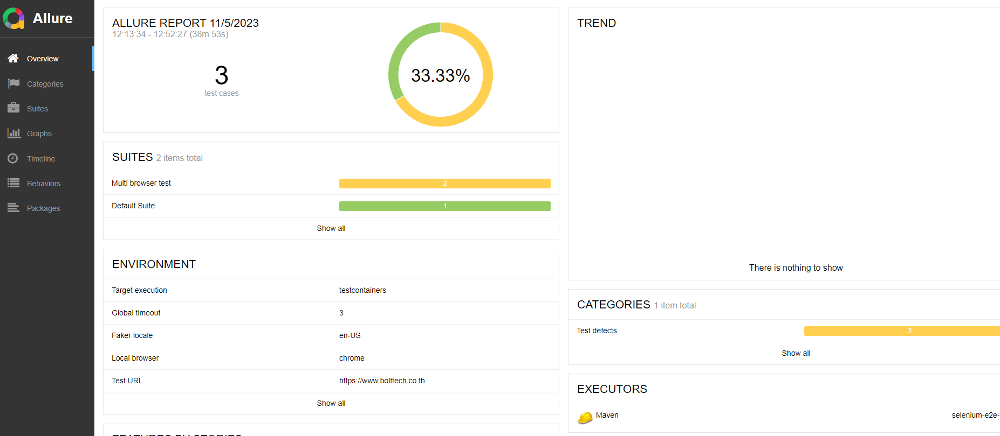

[](https://github.com/uLucasFraga/selenium-e2e-tests/actions/workflows/test-execution.yml)

# SELENIUM-E2E-TESTS

Repository with examples of automation using Selenium + TestNG in java

> Selenium is a portable software-testing framework for web applications. Selenium provides a playback tool for authoring tests without the need to learn a test scripting language.

For more information, see the documentation: [SELENIUM](https://www.selenium.dev/)

---

## Table of Contents

> Index `README`.

- [Prerequisites](#prerequisites)
- [Configuration](#configuration)
- [Installation](#installation)
- [How to run the tests](#how-to-run-the-tests)
- [Profile to executor](#profile-to-executor)
- [Report](#report)
- [Pipeline](#pipeline)
- [Support](#support)

---

## Prerequisites

- [Chocolatey or Scoop](https://chocolatey.org/install)
- [JDK +11](https://www.oracle.com/technetwork/java/javase/downloads/index.html)
- [IntelliJ IDE](https://www.jetbrains.com/idea/download/?section=windows)
- [Maven](https://maven.apache.org/install.html)
- [Allure](https://docs.qameta.io/allure/#_installing_a_commandline)
- [Docker](https://docs.docker.com/engine/install/)

---

## Configuration

Environment variables and bash_profile

> Tips: Use **chocolatey or scoop** for installation.

### Example-JDK:

Configuration and Install JDK: https://community.chocolatey.org/packages/oracle17jdk

```bash
choco install openjdk
```

### Example-Maven

Configuration and Install Maven: https://community.chocolatey.org/packages/maven

```bash
scoop install maven
```

## Installation

Clone this project: https://github.com/ulucasfraga/selenium-e2e-tests.git

```bash
# Install all dependencies (via pom.xml):
cd /selenium-e2e-tests
mvn clean install
```

> Tips:

- Use *pom.xml* to install or remove the project dependencies.

## How to run the tests

#### Execution types and browsers tests

**Environment:**

- local
- local-suite
- selenium-grid
- testcontainers

**Browsers:**

- Chrome
- Firefox
- Edge
- Safari

##### Local:

Access `./src/test/resources/general.properties` and edit the **target** property. Default: `local`.



- run via maven command line:

```bash
mvn clean test
```

- run test choosing browser via maven command line:

```bash
mvn clean test -Dbrowsers=chrome
```

- run tests with IntelliJ:

```markdown
Right click on tests class > Run 'Test'.
```

##### TestContainers:

Testcontainers only supports Chrome and Firefox.

- run tests on containers docker:

```bash
mvn test -Pweb-execution -Dtarget=testcontainers -Dbrowser=chrome
```

##### Selenium Grid

**IMPORTANT:**

If you are using the `docker-compose.yml` file to start the Docker Selenium grid, the values on the `grid.properties`
file should work. For more info: [Docker Selenium](https://github.com/SeleniumHQ/docker-selenium)

- Access `./src/test/resources/general.properties` and edit the **target** property: `remote`
- Access `./src/test/resources/grid.properties` and edit the **grid.url** and **port** property.
- Access folder `./grid` and run: 

```bash
docker-compose up
```
The last step is following:

```markdown
Access ./src/test/resources/suites > Right click on tests *local/grid* > Run 'Test'.
```

##### Parallel Executions

You can define any parallel strategy.
For more info: [TestNG parallel tests](https://testng.org/doc/documentation-main.html#parallel-tests)

```xml
<parameter name="browser" value="chrome"/>
```

Pay attention to the `./grid/config.toml` file that has comments for each specific System Operation!

- up docker images:

```bash
docker-compose up
```
- run tests on docker images:

```bash
mvn test -Pweb-execution -Dsuite=selenium-grid -Dtarget=selenium-grid -Dheadless=true
```

Open the [Selenium Grid](http://localhost:4444/grid/) page to see the status of tests running.

---

## Profile to executor

Profiles executors on `pom.xml` file.

- web-execution: Created to execute the test suite `local.xml` inside `./src/test/resources/suites` folder.
- run multi_browser suite tests:

```bash
mvn test -Pweb-execution -Dtestng.dtd.http=true
```

**OBS:**
Add new suite tests on the `./src/test/resources/suites` folder and add new profile on the `pom.xml` file:



- run using `-Dsuite=suite_name` to call the suite:

```bash
mvn test -Pweb-execution -Dsuite=parallel -Dtestng.dtd.http=true 
```

--- 

## Report

- run to generate an allure report

```bash
mvn allure:serve
```



---

## Pipeline

As an example, you can use different pipeline:

- Jenkins: [CI-JENKINS](http://localhost:8080/job/CI/lastSuccessfulBuild/)
- GitHub: [CI-GITHUB](https://github.com/uLucasFraga/selenium-e2e-tests/actions)


## Support

- LinkedIn at <a href="https://www.linkedin.com/in/ulucasfraga" target="_blank">Lucas Fraga</a>
- E-mail: <ulucasfraga@gmail.com>

---

## License

[](http://badges.mit-license.org)

- **[MIT license](http://opensource.org/licenses/mit-license.php)**
- Copyright 2023 © <a href="https://bolttech.io/" target="_blank">BoltTech</a>.